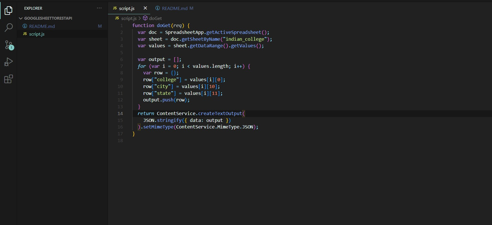
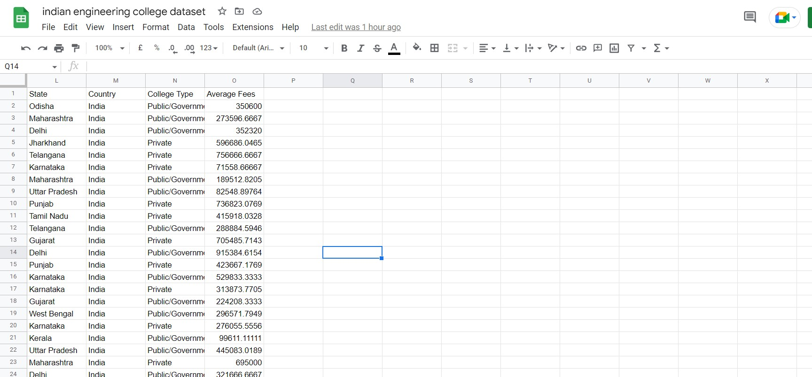
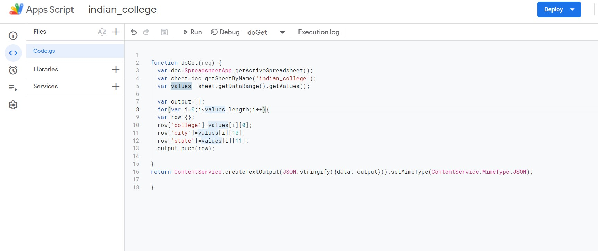
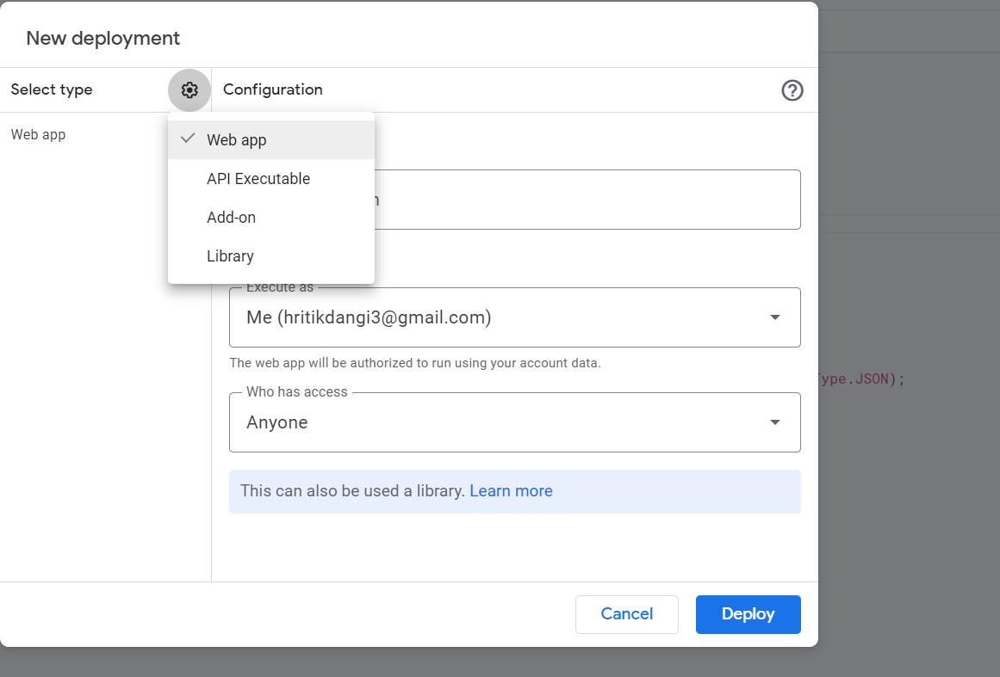
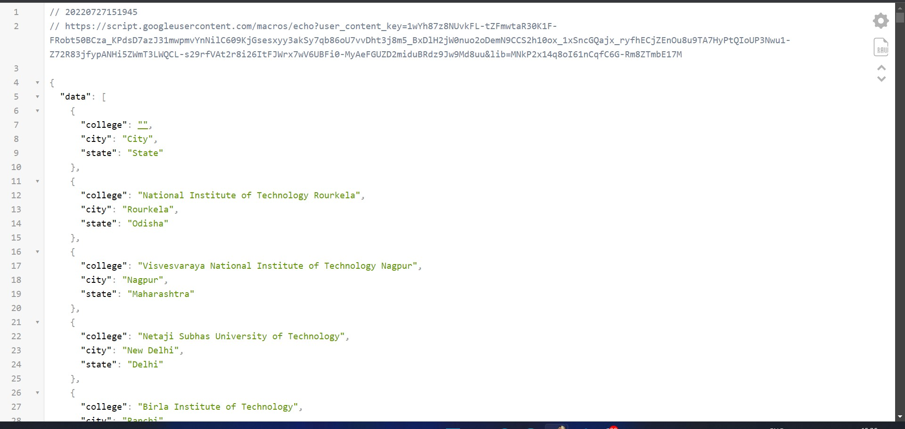

### So here i converted myu google sheet into RestApi using the google inbuilt tool AppScript.

#### Steps to make your own RestApi
- First open google sheets , if you have any csv data so import it or else go to *www.kaggle.com* and generate your favourable dataset and download it as **csv file**
- now import the csv file and rename it accordingly
- click on help section at top and search app, you will see an option either like *App Script* 
- open AppScript and write JS code. 
- after completing click on deployment and then options and select web app
- give it a name and select share to *anyone*
- it will open your google acocunt to authorize and you are good to go 
- Now copy the *URL* i.e, your RestApi and use it in your sideProject

